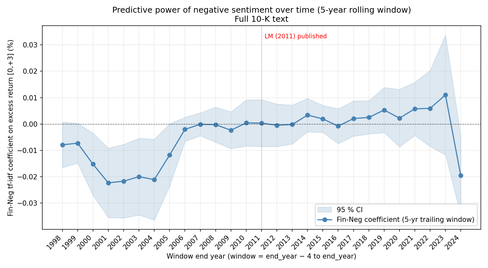
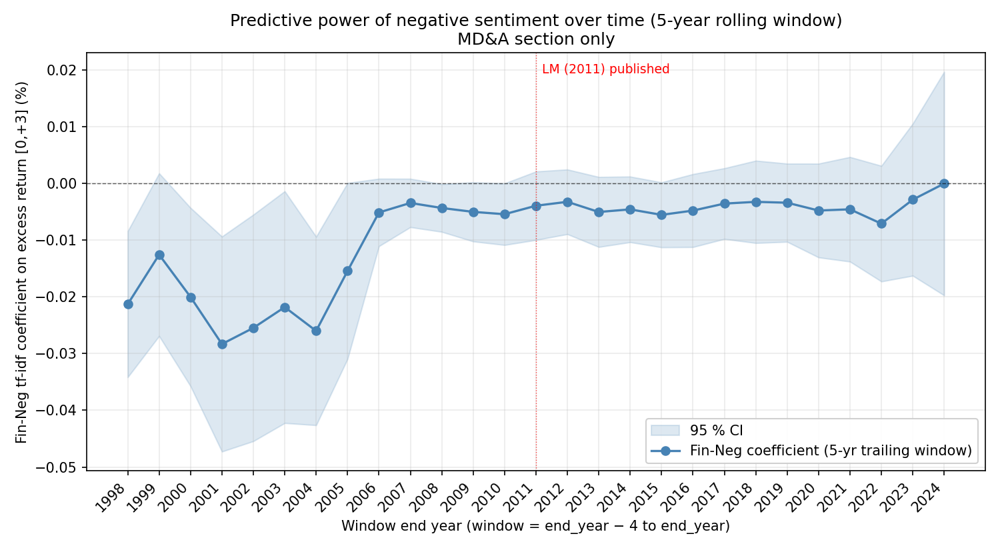

# Out-of-sample extension of LM (2011) — 1994–2024

This document extends the Loughran & McDonald (2011) Fama-MacBeth filing-period excess-return regressions from the LM in-sample window (1994–2008) through end of 2024 (~17 additional years of 10-K filings), using the identical methodology (same dictionary, same controls, same FM weighting, same Newey-West HAC SE, same FF48 industry fixed effects).

The exposition below focuses on the per-filing negative sentiment score based on the LM (2011) financial sentiment dictionary (hereinafter referred to as **Fin-Neg**). The headline specification is the tf-idf-weighted version of Fin-Neg, which weights each negative-tone word by its inverse document frequency across the corpus — the richer of the two LM specifications; the alternative is an unweighted proportional version (negative-word count divided by total words). Each analysis is reported in two parallel versions: one on the full 10-K text and one restricted to the MD&A section only. Results for the unweighted proportional Fin-Neg are reported alongside in the companion tables without separate discussion.

Three questions:

1. **Out-of-sample**: does the tf-idf negative-tone signal still predict four-day excess returns in 2009–2024?
2. **Decay**: how does the coefficient evolve year by year across the full sample?
3. **Regime conditioning**: how does it look in the GFC, the algo-trading era, and COVID-recent windows?

---

## Sample

| Window | Firm-years | Unique permnos | Quarters |
|---|---:|---:|---:|
| LM in-sample (1994–2008) | 50,900 | ~9,000 | 60 |
| Extension (2009–2024) | 32,520 | 6,500+ | 56 |
| Full extended (1994–2024) | 83,422 | 11,125 | 116 |

CRSP daily ends 2024-12-31 (typical WRDS lag), so the +252-day post-filing window required for the sample funnel drops most filings filed in late 2023 onward. The "covid_recent" sub-period has 1,367 firm-years for this reason.

Inputs were rebuilt end-to-end via `code/preclean.py` (`END_YR = 2026`), `code/step1c_manifest_10k_extended.py`, then the standard `step4 → step5 → step6 → step7` pipeline.

One small methodology refinement was added for the post-2009 portion of the sample: inline-XBRL `<ix:hidden>` blocks are stripped from the raw text before tokenization. These blocks wrap content tagged for machine readers but not visible to humans in the rendered document; in early-adopter filings (2019–2022) some filers tagged narrative prose this way, which could double-count LM-dictionary tokens against text the visible reader saw once. Pre-2009 filings have no inline XBRL so this is a no-op on the LM in-sample window. Empirically the change shifts every coefficient by less than 0.5% — the contamination was smaller than feared — but the fix is principled and was retained.

---

## Headline results

### Full 10-K text

| Specification | n | n_qtrs | Coef | t-stat | adj R² |
|---|---:|---:|---:|---:|---:|
| LM (2011) original result | 50,115 | 60 | −0.0030 | −3.11 | 2.63 % |
| My replication (sample period: 1994–2008) | 50,681 | 60 | −0.0094 | −2.76 | 2.52 % |
| Extended sample (1994–2024) | 82,413 | 110 | −0.0044 | −1.80 | 4.00 % |

Each row is a Fama-MacBeth regression of the four-day filing-period excess return on Fin-Neg (tf-idf) with the LM control set and FF48 industry fixed effects: per quarter we run a single cross-sectional regression and save its Fin-Neg coefficient, then average those per-quarter coefficients across the `n_qtrs` quarters in the row. The reported t-stat is that pooled average divided by a Newey-West HAC (1 lag) standard error on the per-quarter coefficient series.

In the full extended sample the headline tf-idf coefficient remains negative (p ≈ 0.072), but less significant than in the LM in-sample reproduction. The pooled result is dominated by the LM in-sample sub-period; the sub-period and rolling-window decompositions below show where the signal lives.

### MD&A section only

| Specification | n | n_qtrs | Coef | t-stat | adj R² |
|---|---:|---:|---:|---:|---:|
| LM (2011) original result | 37,287 | 60 | −0.0060 | −1.96 | 2.76 % |
| My replication (sample period: 1994–2008) | 48,134 | 60 | −0.0151 | −3.56 | 2.46 % |
| Extended sample (1994–2024) | 79,656 | 110 | −0.0108 | −3.81 | 4.09 % |

The MD&A-restricted specification is more robust than the full-text version: the t-stat is actually larger in absolute value in the extended sample than in the LM in-sample sub-period. This is the cleanest evidence that managerial-discretion tone — the MD&A section is where Reg S-K Item 303 directs management to discuss known trends and uncertainties — continues to carry priceable information through 2024.

---

## Sub-period replication

Each subperiod is re-fit with the same Fama-MacBeth regression on its own quarterly cross-sections.

### Full 10-K text

| Subperiod | Years | n | n_qtrs | Coef | t-stat | adj R² |
|---|---|---:|---:|---:|---:|---:|
| LM_in_sample | 1994–2008 | 50,681 | 60 | −0.0094 | −2.76 | 2.52 % |
| GFC | 2008–2009 | 6,077 | 8 | −0.0071 | −1.49 | 3.48 % |
| post_LM | 2009–2014 | 17,363 | 24 | +0.0013 | +0.41 | 4.53 % |
| algo_era | 2015–2019 | 13,127 | 20 | +0.0053 | +1.21 | 8.06 % |
| covid_recent | 2020–2024 | 1,242 | 6 | −0.0195 | −2.53 | 0.32 % |
| full | 1994–2024 | 82,413 | 110 | −0.0044 | −1.80 | 4.00 % |

The full-text signal is concentrated in the LM_in_sample row. It flips to positive (insignificant) in `post_LM` and `algo_era` — the early post-publication period and the algo-trading era — then sharply turns negative again in `covid_recent`. The `covid_recent` row has n = 1,242 / R² = 0.32 % across only 6 quarters; treat its t = −2.53 as a small-sample point estimate rather than a stable regime finding.

### MD&A section only

| Subperiod | Years | n | n_qtrs | Coef | t-stat | adj R² |
|---|---|---:|---:|---:|---:|---:|
| LM_in_sample | 1994–2008 | 48,134 | 60 | −0.0151 | −3.56 | 2.46 % |
| GFC | 2008–2009 | 6,027 | 8 | −0.0064 | −1.21 | 3.38 % |
| post_LM | 2009–2014 | 17,241 | 24 | −0.0049 | −1.72 | 4.36 % |
| algo_era | 2015–2019 | 13,044 | 20 | −0.0034 | −0.96 | 7.52 % |
| covid_recent | 2020–2024 | 1,237 | 6 | −0.0000 | −0.00 | 3.27 % |
| full | 1994–2024 | 79,656 | 110 | −0.0108 | −3.81 | 4.09 % |

The MD&A specification carries a negative coefficient in every single sub-period. Statistical significance is concentrated in the LM in-sample row and the full pooled fit (t = −3.81), with `post_LM` borderline at t = −1.72. The contrast with the full-text panel is the key empirical claim of the extension: the discretionary MD&A region preserves a directionally consistent signal even where the broader full-text version has decayed.

### Companion: Fin-Neg proportional (un-weighted)

For completeness, the proportional (unweighted) results across the same subperiods:

| Subperiod | Years | Full-text t-stat | Full-text R² | MD&A t-stat | MD&A R² |
|---|---|---:|---:|---:|---:|
| LM_in_sample | 1994–2008 | −3.04 | 2.29 % | −3.54 | 2.37 % |
| GFC | 2008–2009 | −0.18 | 3.44 % | −2.79 | 3.24 % |
| post_LM | 2009–2014 | +1.16 | 4.58 % | −0.63 | 4.40 % |
| algo_era | 2015–2019 | +0.90 | 7.57 % | −2.04 | 7.36 % |
| covid_recent | 2020–2024 | +0.36 | −0.46 % | +1.20 | 2.42 % |
| full | 1994–2024 | −1.68 | 3.77 % | −3.41 | 3.93 % |

The proportional-weighted result tells the same story qualitatively: full-text loses significance and even flips sign in post-LM / algo-era; MD&A stays negative pooled (t = −3.41) and significant in three of five sub-periods.

---

## Rolling-window decay

### Design

The sub-period analysis above partitions the sample into a handful of disjoint regimes (LM_in_sample, GFC, post_LM, …). That collapses what is plausibly a gradual evolution of the negative-tone signal into discrete buckets and depends on where we drew the boundaries. The rolling-window analysis below avoids both issues — it asks, year by year, *what does the tf-idf Fin-Neg coefficient look like if we re-fit it only on the trailing 5 years of filings?*

The procedure indexes windows by their end year *y*. For each end year:

1. Take the subset of the extended panel with `date_filed` in calendar years `[y − 4, y]` — a 5-year backward-looking window of filings, giving 5 × 4 = 20 quarterly cross-sections.
2. Run the same Fama-MacBeth quarterly cross-sectional regression on Fin-Neg tf-idf with the standard control set (log size + log BM + log turnover + pre-event FF-α + IO + NASDAQ + FF48 industry FEs). Save the per-quarter Fin-Neg coefficient β_q.
3. The window's reported coefficient is the time-series average β̄ across those ~20 quarterly βs, weighted by *n_obs/q*. The standard error is a Newey-West HAC (1 lag) on the β_q series. R² is the simple time-series average of per-quarter adjusted R².
4. Increment the end year by one and repeat.

Pre-1994 filings are excluded entirely. EDGAR was launched in May 1993 and mandatory electronic filing only phased in by May 1996; the manifest contains just 6 raw 10-K filings for calendar-year 1993, of which 2 survive the sample funnel. Aligning the window's earliest year with LM (2011)'s own sample-start convention means the first window has end year `1998` (covering filings 1994–1998); the last window has end year `2024` (covering 2020–2024). That gives 27 windows in total.

Compared to the discrete sub-period table, the rolling design (i) smooths through quarter-to-quarter noise via the four-year overlap, (ii) makes "decay or stable?" a continuous-time question rather than a comparison of bucketed snapshots, (iii) lets us draw a single chart with a 95 % confidence band that a recruiter can read without parsing six rows of t-statistics, and (iv) uses only backward-looking information at each year *y* — the chart at point *y* never knows about post-*y* data.

A caveat for the late windows: the end year *y* requires CRSP daily coverage to extend to roughly `y + 1` (so the +252-day post-window of filings in year *y* is observable). At the current WRDS CRSP daily end of 2024-12-31, the `y = 2024` window's effective sample is just `n = 1,242` and only 6 quarters, so its point estimate is noisy — that's the rightmost point on the chart.

### Full 10-K text

(*plot file*: `output/fig_sentiment_decay.png`; underlying CSV: `output/sentiment_decay.csv`)

| End year | Window | n | Coef | t-stat | adj R² |
|---:|---|---:|---:|---:|---:|
| 1998 | 1994–1998 | 14,849 | −0.0079 | −1.79 | 1.46 % |
| 1999 | 1995–1999 | 17,915 | −0.0073 | −1.88 | 0.75 % |
| 2000 | 1996–2000 | 20,258 | −0.0152 | −2.53 | 1.71 % |
| 2001 | 1997–2001 | 20,966 | −0.0223 | −3.32 | 2.85 % |
| 2002 | 1998–2002 | 19,862 | −0.0217 | −3.05 | 2.68 % |
| 2003 | 1999–2003 | 18,662 | −0.0200 | −2.69 | 3.24 % |
| 2004 | 2000–2004 | 17,990 | −0.0211 | −2.70 | 4.10 % |
| 2005 | 2001–2005 | 17,226 | −0.0118 | −1.95 | 3.43 % |
| 2006 | 2002–2006 | 17,043 | −0.0020 | −0.87 | 1.82 % |
| 2007 | 2003–2007 | 17,063 | −0.0001 | −0.05 | 2.42 % |
| 2008 | 2004–2008 | 17,170 | −0.0003 | −0.08 | 2.68 % |
| 2009 | 2005–2009 | 16,387 | −0.0024 | −0.66 | 2.88 % |
| 2010 | 2006–2010 | 16,009 | +0.0004 | +0.09 | 3.66 % |
| 2011 | 2007–2011 | 15,594 | +0.0003 | +0.07 | 4.41 % |
| 2012 | 2008–2012 | 15,011 | −0.0005 | −0.12 | 4.36 % |
| 2013 | 2009–2013 | 14,450 | −0.0002 | −0.06 | 4.38 % |
| 2014 | 2010–2014 | 14,639 | +0.0034 | +1.04 | 4.42 % |
| 2015 | 2011–2015 | 14,526 | +0.0019 | +0.74 | 4.84 % |
| 2016 | 2012–2016 | 14,314 | −0.0008 | −0.24 | 5.49 % |
| 2017 | 2013–2017 | 14,152 | +0.0021 | +0.60 | 6.33 % |
| 2018 | 2014–2018 | 13,824 | +0.0025 | +0.78 | 8.20 % |
| 2019 | 2015–2019 | 13,127 | +0.0053 | +1.21 | 8.06 % |
| 2020 | 2016–2020 | 10,954 | +0.0022 | +0.40 | 7.88 % |
| 2021 | 2017–2021 | 8,619 | +0.0058 | +1.12 | 6.91 % |
| 2022 | 2018–2022 | 5,922 | +0.0059 | +0.80 | 6.08 % |
| 2023 | 2019–2023 | 3,458 | +0.0110 | +0.95 | 3.44 % |
| 2024 | 2020–2024 | 1,242 | −0.0195 | −2.53 | 0.32 % |

The full-text coefficient is negative and significant (t below −2) only for end years 2000–2004 and the single 2024 window. The 1998–1999 windows are borderline, and the long stretch from end year 2006 through 2023 oscillates sign with t-stats between −1.0 and +1.2 — economically indistinguishable from zero. The end-year 2024 row uses only n = 1,242 firm-years over 6 quarters (because of the CRSP-daily cutoff at 2024-12-31) and is reported for completeness.

### MD&A section only

(*plot file*: `output/fig_sentiment_decay_mda.png`; underlying CSV: `output/sentiment_decay_mda.csv`)

| End year | Window | n | Coef | t-stat | adj R² |
|---:|---|---:|---:|---:|---:|
| 1998 | 1994–1998 | 13,452 | −0.0213 | −3.24 | 1.81 % |
| 1999 | 1995–1999 | 16,391 | −0.0126 | −1.71 | 0.91 % |
| 2000 | 1996–2000 | 18,724 | −0.0200 | −2.49 | 1.86 % |
| 2001 | 1997–2001 | 19,545 | −0.0283 | −2.93 | 3.00 % |
| 2002 | 1998–2002 | 18,693 | −0.0255 | −2.50 | 2.75 % |
| 2003 | 1999–2003 | 17,734 | −0.0218 | −2.09 | 3.06 % |
| 2004 | 2000–2004 | 17,252 | −0.0260 | −3.06 | 3.96 % |
| 2005 | 2001–2005 | 16,665 | −0.0154 | −1.95 | 3.24 % |
| 2006 | 2002–2006 | 16,633 | −0.0051 | −1.68 | 1.56 % |
| 2007 | 2003–2007 | 16,759 | −0.0034 | −1.57 | 2.04 % |
| 2008 | 2004–2008 | 16,948 | −0.0043 | −2.01 | 2.38 % |
| 2009 | 2005–2009 | 16,220 | −0.0050 | −1.88 | 2.63 % |
| 2010 | 2006–2010 | 15,866 | −0.0054 | −1.95 | 3.47 % |
| 2011 | 2007–2011 | 15,464 | −0.0039 | −1.27 | 4.08 % |
| 2012 | 2008–2012 | 14,893 | −0.0032 | −1.11 | 4.12 % |
| 2013 | 2009–2013 | 14,345 | −0.0050 | −1.59 | 4.15 % |
| 2014 | 2010–2014 | 14,541 | −0.0046 | −1.54 | 4.19 % |
| 2015 | 2011–2015 | 14,442 | −0.0055 | −1.89 | 4.62 % |
| 2016 | 2012–2016 | 14,234 | −0.0048 | −1.45 | 5.42 % |
| 2017 | 2013–2017 | 14,074 | −0.0035 | −1.11 | 6.38 % |
| 2018 | 2014–2018 | 13,740 | −0.0032 | −0.87 | 8.08 % |
| 2019 | 2015–2019 | 13,044 | −0.0034 | −0.96 | 7.52 % |
| 2020 | 2016–2020 | 10,883 | −0.0048 | −1.13 | 7.16 % |
| 2021 | 2017–2021 | 8,563 | −0.0045 | −0.97 | 7.81 % |
| 2022 | 2018–2022 | 5,882 | −0.0071 | −1.36 | 6.89 % |
| 2023 | 2019–2023 | 3,437 | −0.0028 | −0.42 | 4.87 % |
| 2024 | 2020–2024 | 1,237 | −0.0000 | −0.00 | 3.27 % |

The MD&A coefficient is negative in every one of the 27 windows. Statistical significance (|t| ≥ 1.96) is concentrated in 1998 and 2000–2005, with marginal significance (|t| between 1.5 and 1.96) holding for many of the post-2005 windows. The qualitative contrast with the full-text panel above is the headline finding: where the full-text signal decays and oscillates sign post-2005, the MD&A signal weakens in magnitude but stays directionally consistent throughout.

---

## Event-window robustness

LM (2011) defines its CAR over a four-day window `[0, +3]` covering the filing day plus three subsequent trading days. To check whether the result is special to that window, each subperiod regression is re-fit with three LHS event windows: `[0,+1]`, `[0,+3]` (LM canonical), `[0,+5]`. (Longer horizons of `[0,+10]` / `[0,+20]` were considered but excluded — at two-to-four-week horizons the LHS is contaminated by drift, by other firms' earnings surprises, and by macroeconomic news unrelated to the 10-K release, so the regression no longer cleanly identifies a filing-period effect.) Each cell below shows `t (adj R²)`.

### Full 10-K text

| Subperiod (n_qtrs) | n (canonical) | [0,+1] | [0,+3] | [0,+5] |
|---|---:|---:|---:|---:|
| LM_in_sample (60q) | 50,681 | −1.66 (1.99 %) | −2.76 (2.52 %) | −2.25 (2.69 %) |
| post_LM (24q) | 17,363 | +0.17 (3.36 %) | +0.41 (4.53 %) | +0.52 (5.04 %) |
| algo_era (20q) | 13,127 | +0.77 (6.86 %) | +1.21 (8.06 %) | +1.97 (8.38 %) |
| covid_recent (6q) | 1,242 | −0.05 (2.89 %) | −2.53 (0.32 %) | −2.03 (9.66 %) |
| full (110q) | 82,413 | −1.04 (3.26 %) | −1.80 (4.00 %) | −1.32 (4.78 %) |

The LM in-sample t-stats are stable across the three event windows, peaking at the canonical `[0,+3]`. Post-LM and algo-era are flat to slightly positive at every window, indicating the full-text signal does not survive at any reasonable post-filing horizon after 2008.

### MD&A section only

| Subperiod (n_qtrs) | n (canonical) | [0,+1] | [0,+3] | [0,+5] |
|---|---:|---:|---:|---:|
| LM_in_sample (60q) | 48,134 | −2.24 (1.73 %) | −3.56 (2.46 %) | −3.03 (2.52 %) |
| post_LM (24q) | 17,241 | −1.48 (3.17 %) | −1.72 (4.36 %) | +0.18 (4.74 %) |
| algo_era (20q) | 13,044 | −1.38 (6.63 %) | −0.96 (7.52 %) | −0.69 (7.56 %) |
| covid_recent (6q) | 1,237 | −0.06 (3.96 %) | −0.00 (3.27 %) | +1.20 (14.88 %) |
| full (110q) | 79,656 | −2.90 (3.04 %) | −3.81 (4.09 %) | −2.74 (4.79 %) |

The MD&A coefficient is negative at the `[0,+1]` and `[0,+3]` windows in every sub-period except the small COVID-era 6-quarter sample. The full-pooled t-stats are `−2.90 / −3.81 / −2.74` across the three event windows — the MD&A spec is significantly negative at every horizon, with `[0,+3]` again the local maximum.

### Companion: Fin-Neg proportional across the same windows

| Subperiod | n | Full-text [0,+1] | Full-text [0,+3] | Full-text [0,+5] | MD&A [0,+1] | MD&A [0,+3] | MD&A [0,+5] |
|---|---:|---:|---:|---:|---:|---:|---:|
| LM_in_sample | 50,681 | −2.16 | −3.04 | −2.65 | −2.11 | −3.54 | −3.07 |
| post_LM | 17,363 | +0.76 | +1.16 | +1.13 | −0.70 | −0.63 | +0.36 |
| algo_era | 13,127 | +0.55 | +0.90 | +1.78 | −2.77 | −2.04 | −1.73 |
| covid_recent | 1,242 | +2.38 | +0.36 | −0.90 | −0.10 | +1.20 | +1.81 |
| full | 82,413 | −0.16 | −1.68 | −1.05 | −2.81 | −3.41 | −2.58 |

Three patterns emerge:

1. **LM in-sample is window-robust.** Across both the full-text and MD&A specs, the canonical `[0,+3]` t-statistic is the local maximum (in absolute value) of a hump that includes `[0,+1]` and `[0,+5]`. The signal is real on the 1994–2008 sub-window and is not an artifact of choosing exactly four days.

2. **The decay is most visible in the very-short windows.** For the `post_LM` and `algo_era` sub-periods, the `[0,+1]` and `[0,+3]` t-statistics on full-text tf-idf cluster near zero or flip sign. If markets price negative tone faster post-2010 than they did in the 1990s, the short-window absence of signal is consistent with that.

3. **MD&A tf-idf is the most window-stable.** For the MD&A-only spec, the full extended sample shows `t = −2.90 / −3.81 / −2.74` across `[0,+1] / [0,+3] / [0,+5]`. The negative sign also persists in MD&A across most sub-periods at the canonical `[0,+3]` window. The robustness reflects that MD&A text — forward-looking commentary by management — carries information that is priced over a longer post-filing horizon than mechanical text features in the rest of the 10-K.

---

## Interpretation

Two qualitatively different stories emerge from the rolling-window decompositions:

**Full 10-K text.** The tf-idf negative-tone signal is statistically significant and negatively-signed only in two stretches of the rolling decomposition:

- end years 2000–2004 (windows covering filings 1996–2000 through 2000–2004), with t between −2.69 and −3.32 and R² between 1.71 % and 4.10 %, and
- the lone end year 2024 (window 2020–2024), with t = −2.53 / R² = 0.32 % on n = 1,242.

In all other rolling windows the coefficient is near zero with t between −1.0 and +1.2. The classical post-publication-arbitrage explanation (McLean & Pontiff 2016) cannot account for this pattern alone: the rolling-window coefficient drifts to zero by end year 2006 (window 2002–2006), which corresponds to filings made well before Loughran & McDonald (2011) was published in early 2011. Three non-exclusive candidate mechanisms are worth flagging without a clean test of any of them:

1. **Pre-publication discovery.** Tetlock (2007, *JF*) used the Harvard IV-4 dictionary on Wall Street Journal media content. Practitioner sentiment scoring of news + filings (Reuters, Bloomberg, RavenPack) was deployed in the same window. Filing-period negative-tone may have been priced by sentiment-active quants before LM curated their finance-specific dictionary.

2. **Disclosure-norm shift after Sarbanes-Oxley (2002).** Post-SOX 10-Ks contain richer cautionary boilerplate and lengthy risk factors, and from 2009 inline XBRL tags. The Table II mean of Fin-Neg in the full extended sample is 1.56 % vs the LM in-sample mean of 1.37 %, consistent with rising boilerplate that dilutes idiosyncratic tone variation.

3. **Algorithmic pricing of public text.** From 2010 onward, the LM Master Dictionary is embedded in many quant pipelines. Negative tone may now be priced within minutes of filing release, leaving no four-day excess-return predictability available to academic researchers using daily CRSP returns.

**MD&A section only.** The MD&A-restricted coefficient is negative in every single rolling window across 1998–2024 and significant pooled (t = −3.81) on the full extended sample. The signal weakens in magnitude after about 2006 — broadly the same inflection point as full-text — but never crosses zero. This pattern is consistent with the regulatory framing of MD&A under Reg S-K Item 303: management is required to discuss known trends, demands, and uncertainties, so the MD&A region carries discretionary forward-looking content that is harder to mechanically arbitrage than risk-factor and footnote boilerplate. The MD&A-only specification is the single specification that remains significant pooled across 1994–2024.

---

## Files

| File | Source script |
|---|---|
| `output/table1_sample_funnel_default.csv` | `step5_build_sample.py` (extended) |
| `output/table2_extended.csv` | `step7_tables.py` |
| `output/table4_cols2_4_extended.csv` | `step7_tables.py` |
| `output/table5_cols2_4_extended.csv` | `step7_tables.py` |
| `output/table_subperiods.csv`, `.md` | `step9_subperiods.py` |
| `output/sentiment_decay.csv`, `output/sentiment_decay_mda.csv` | `step10_decay.py` |
| `output/fig_sentiment_decay.png`, `output/fig_sentiment_decay_mda.png` | `step10_decay.py` |
| `output/table_event_windows.csv`, `.md` | `step11_event_windows.py` |

---

## References

- Loughran, Tim, and Bill McDonald, 2011. “When Is a Liability Not a Liability? Textual Analysis, Dictionaries, and 10-Ks”, *Journal of Finance* 66(1): 35–65.
- McLean, R. D., and Jeffrey Pontiff, 2016. “Does Academic Research Destroy Stock Return Predictability?”, *Journal of Finance* 71(1): 5–32.
- Tetlock, Paul C., 2007. “Giving Content to Investor Sentiment: The Role of Media in the Stock Market”, *Journal of Finance* 62(3): 1139–1168.
